#Online Spatio-Temporal Action Detection with Adaptive Sampling and Hierarchical Modulation

## Overview of ASN-HM
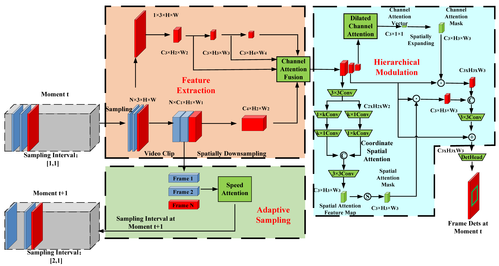


## Requirements
- We recommend you to use Anaconda to create a conda environment:
```Shell
conda create -n asn-hm python=3.6
```

- Then, activate the environment:
```Shell
conda activate asn-hm 
```

- Requirements:
```Shell
pip install -r requirements.txt 
```

## Visualization on UCF24
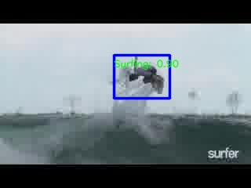
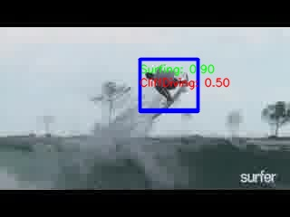
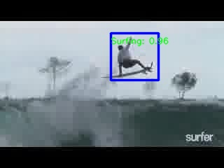
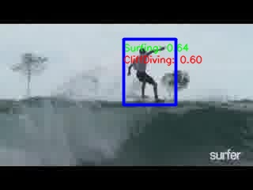
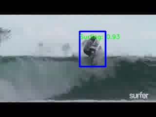

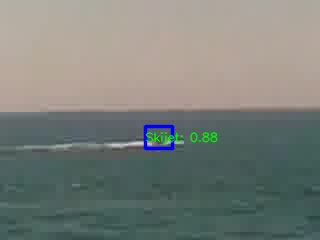
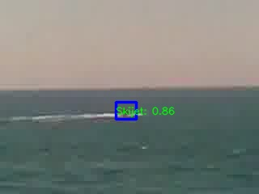
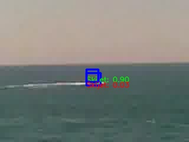
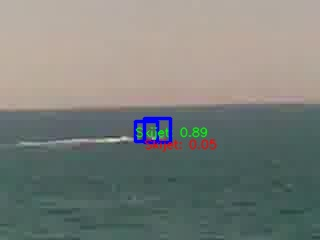
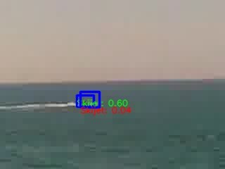

# Experiment

|      Dataset    |  Sampling   | F-mAP | V-mAP |   FPS   | 
|-----------|--------|--------|-------|-------|
| JHMDB21   |   16xδ    | 78.6  | 86.5 |   32    | 
|  UCF24  |   16xδ   |  87.2  | 58.3  |   32    | 


# Dataset

## UCF101-24:
You can download **UCF24** from the following links:

* Google drive

Link: https://drive.google.com/file/d/1Dwh90pRi7uGkH5qLRjQIFiEmMJrAog5J/view?usp=sharing

* BaiduYun Disk

Link: https://pan.baidu.com/s/11GZvbV0oAzBhNDVKXsVGKg

Password: hmu6 

## Train ASN-HM
* UCF101-24

For example:

```Shell
python -m torch.distributed.launch --nnodes 1 --nproc_per_node 2 train.py --cuda -d ucf24 --data_root /data1/su/datasets/UCF24-YOWO/ -bs 32 -tbs 16 -K 16 -accu 8 -v asn --max_epoch 7 --lr_epoch 2 3 4 5 --eval -ct 0.05 --distributed --sybn (--resume weights/ucf24/asn/asn_epoch_1.pth) 
```

##  Test ASN-HM
* Frame-mAP：

```Shell
python eval.py --cuda -d ucf24 --data_root /data1/su/datasets/UCF24-YOWO/ -tbs 16 -v asn --weight weights/ucf24/asn/asn_epoch_0.pth -ct 0.05 --cal_frame_mAP
```
* Video mAP：

```Shell
python eval.py --cuda -d ucf24 --data_root /data1/su/datasets/UCF24-YOWO/ -tbs 16 -v asn --weight weights/ucf24/asn/asn_epoch_0.pth -ct 0.05 --cal_video_mAP --link_method mchl
```
## Note
Model weights and detection results can be downloaded from the cloud drive link below.

Link: https://pan.baidu.com/s/1iacp0hSeR0wD_lAS721Jjg?pwd=1xkq 
password：1xkq 

Currently, only part of the code is released. The complete code will be released after the paper is accepted.